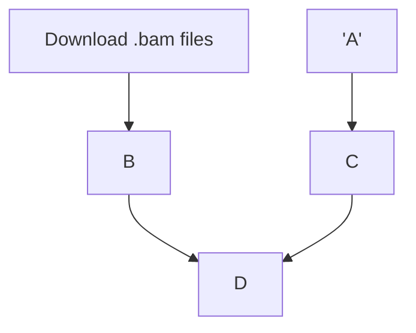
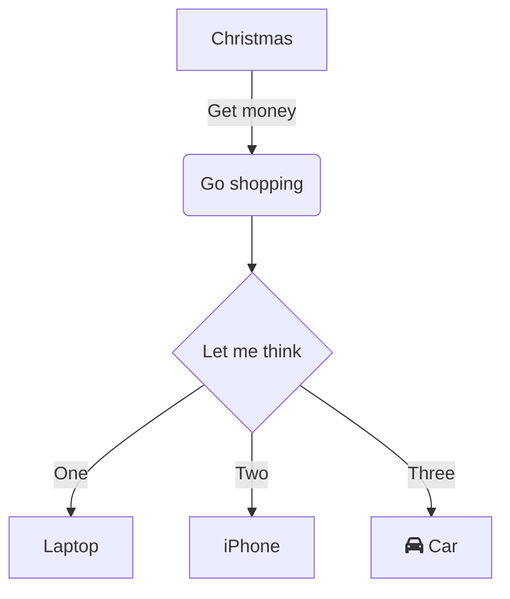
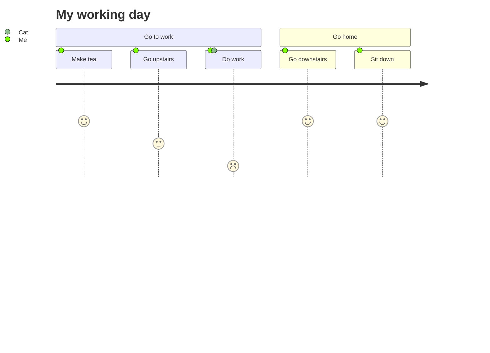

--min-seq-id to zwyczajowo 0.9
understand the result: representative\tcluster_member

CITATION 1000 genomes: https://academic.oup.com/nar/article/48/D1/D941/5580898

Cluster counts:
0.950 => 3
0.955 => 5
0.960 => 8
0.965 => 14
0.970 => 28
0.975 => 45
0.980 => 69
0.985 => 105
0.990 => 149
0.995 => 231

### References:
- [A global reference for human genetic variation](http://www.nature.com/nature/journal/v526/n7571/full/nature15393.html), The 1000 Genomes Project Consortium, Nature 526, 68-74 (01 October 2015) doi:10.1038/nature15393, which provided the following:
    - [High coverage whole genome sequencing of the expanded 1000 Genomes Project cohort including 602 trios](https://www.biorxiv.org/content/10.1101/2021.02.06.430068v2): Marta Byrska-Bishop, Uday S. Evani, Xuefang Zhao, Anna O. Basile, Haley J. Abel, Allison A. Regier, André Corvelo, Wayne E. Clarke, Rajeeva Musunuri, Kshithija Nagulapalli, Susan Fairley, Alexi Runnels, Lara Winterkorn, Ernesto Lowy, The Human Genome Structural Variation Consortium, Paul Flicek, Soren Germer, Harrison Brand,  View ORCID ProfileIra M. Hall, Michael E. Talkowski,  View ORCID ProfileGiuseppe Narzisi, Michael C. Zody
    - [Insights into human genetic variation and population history from 929 diverse genomes](https://www.science.org/doi/10.1126/science.aay5012), Science vol 367, issue 6484:
 Anders Bergström, Shane A. McCarthy,  Ruoyun Hui, Mohamed A. Almarri, Qasim Ayub, Petr Danecek, Yuan Chen, Sabine Felkel, Pille Hallast, Jack Kamm, Hélène Blanché, Jean-François Deleuze, Howard Cann, Swapan Mallick, David Reich, Manjinder S. Sandhu, Pontus Skoglund, Aylwyn Scally, Yali Xue, Richard Durbin and Chris Tyler-Smith