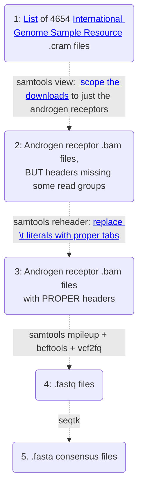
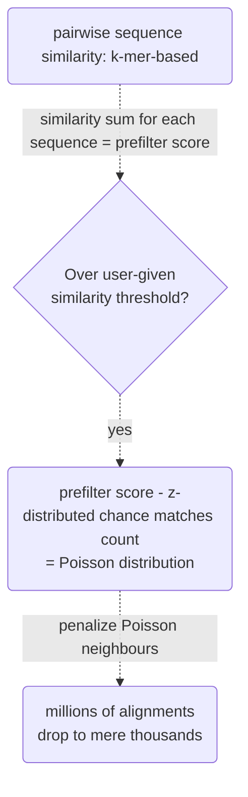
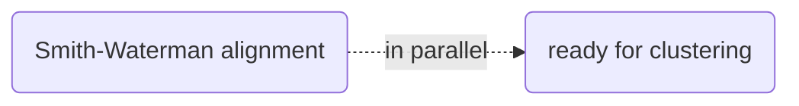
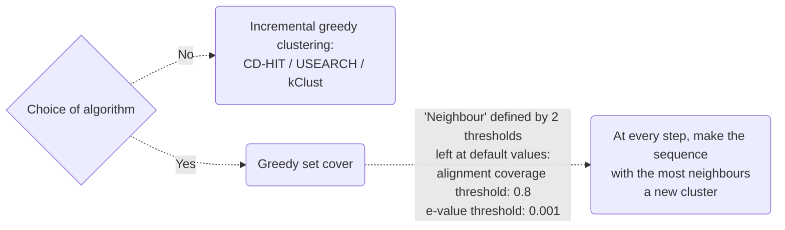

# Androgen receptor clusters: world map (4654 genomes)

Part of an ongoing exploration of androgen receptors from publicly available genomes. 
 The map should be available [here](https://engelanna-androgen-receptor-cl-build-streamlit-main-page-bje6e5.streamlitapp.com/).

## Table of Contents
[Intro: Why care about the androgen receptor?](#why-care-about-the-androgen-receptor)

[Phase 1: Data acquisition and cleaning](#phase-1-data-acquisition--cleaning)

[Phase 2: Clustering with many-against-many sequence searching](#phase-2-clustering-by-many-against-many-sequence-searching)

[References](#references)

---

## Why care about the androgen receptor?

The androgen receptor (located on the X chromosome) is responsible for how thick one's bones get over the course of one's life (which includes bone density in old age, a major contributor to potentially deadly fractures), and how easily one puts on muscle. Significantly fewer than the average 22 polyglutamine repeats (CAGCAGCAG...) can kill males via prostate cancer (especially those of African descent).

Significantly > 22 repeats (highest average: Thai people) can bring insufficient fetal masculinization of the brain's stria terminalis (leading to gender dysphoria at puberty onwards) or of the body (intersexualism), more commonly "just" resulting in fertility problems. Too many CAG repeats have also been linked to increased suicidal depression in teenagers (as well as left-handedness).

That's a lot of suffering in one tiny protein, whose dangerous mutations - in the age of [CRISPR/Cas9](http://www.crisprtx.com/gene-editing/crispr-cas9) - may simply become editable out of the genome. But the AR needs to be better understood first. Of note, individuals possessing multiple X chromosomes (including most, but not all, females - cf. Turner syndrome) are an order of magnitude less affected by the aforementioned issues.

---

## Phase 1: Data acquisition & cleaning

---

## Phase 2: Clustering by many-against-many sequence searching

### Step 1/3: Prefilter

### Step 2/3: Alignment

### Step 3/3: Clustering

mmseqs easy-cluster ../androgen-receptor-clustering/assets/fasta/clustering_input/mmseqs_input.fasta min-seq-id-0.9998/clusterRes tmp --min-seq-id 0.9998 

--min-seq-id to zwyczajowo 0.9
understand the result: representative\tcluster_member

Gap open cost                       	aa:11,nucl:5
Gap extension cost                  	aa:1,nucl:2
Alphabet size                       	aa:21,nucl:5
k-mers per sequence                 	21
Adjusted k-mer length 17
Clustering mode: Set Cover
Number of clusters: 
Estimated memory consumption: 8G
Time: FIND THIS IN THE LOGS
Approx processing time
.995 
n = 4654

| Minimum sequence identity | Approximate run time | Estimated memory consumption |
|-:|:-|:-|
| 99.5% | 25:24 | 8G |
| 99.6% | 27:41 | -//- |
| 99.7% | 33:51 | -//- |
| 99.8% | 39:30 | -//- |
| 99.9% | 43:20 | -//- |
| 99.95% | 50:24 | -//- |
| 99.96% | 49:48 | -//- |
| 99.97% | 47:29 | -//- |
| 99.98% | 61:11 | -//- |
| 99.99% | 67:09 | 9G |

## References:
- [A global reference for human genetic variation](http://www.nature.com/nature/journal/v526/n7571/full/nature15393.html), The 1000 Genomes Project Consortium, Nature 526, 68-74 (01 October 2015) doi:10.1038/nature15393, which provided the following:
    - [High coverage whole genome sequencing of the expanded 1000 Genomes Project cohort including 602 trios](https://www.biorxiv.org/content/10.1101/2021.02.06.430068v2): Marta Byrska-Bishop, Uday S. Evani, Xuefang Zhao, Anna O. Basile, Haley J. Abel, Allison A. Regier, André Corvelo, Wayne E. Clarke, Rajeeva Musunuri, Kshithija Nagulapalli, Susan Fairley, Alexi Runnels, Lara Winterkorn, Ernesto Lowy, The Human Genome Structural Variation Consortium, Paul Flicek, Soren Germer, Harrison Brand,  View ORCID ProfileIra M. Hall, Michael E. Talkowski,  View ORCID ProfileGiuseppe Narzisi, Michael C. Zody
    - [Insights into human genetic variation and population history from 929 diverse genomes](https://www.science.org/doi/10.1126/science.aay5012), Science vol 367, issue 6484: Anders Bergström, Shane A. McCarthy,  Ruoyun Hui, Mohamed A. Almarri, Qasim Ayub, Petr Danecek, Yuan Chen, Sabine Felkel, Pille Hallast, Jack Kamm, Hélène Blanché, Jean-François Deleuze, Howard Cann, Swapan Mallick, David Reich, Manjinder S. Sandhu, Pontus Skoglund, Aylwyn Scally, Yali Xue, Richard Durbin and Chris Tyler-Smith
- [Clustering huge protein sequence sets in linear time](https://www.nature.com/articles/s41467-018-04964-5), Nature Communications, doi: 10.1038/s41467-018-04964-5 (2018): Steinegger M and Soeding J.